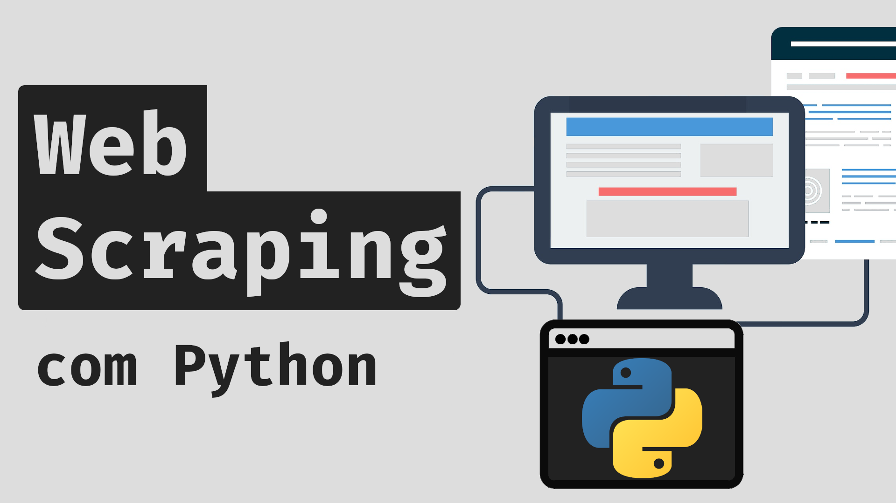

# Web Scraping com Python

Esse repositório contém arquivos (slides, códigos, exemplos) desenvolvidos durante uma série de vídeos do meu canal do YouTube, a qual pode ser acessada [nesse link](https://www.youtube.com/watch?v=42sTntMEn6o&list=PLg3ZPsW_sghSkRacynznQeEs-vminyTQk).

## Conteúdo

Essa série de vídeos contém o seguinte conteúdo:

1. Introdução ao HTML
2. Inspecionando sites
3. Protocolo e Requisições HTTP
4. Módulo `requests`
5. Módulo `BeautifulSoup`
6. Exemplos
7. Projeto